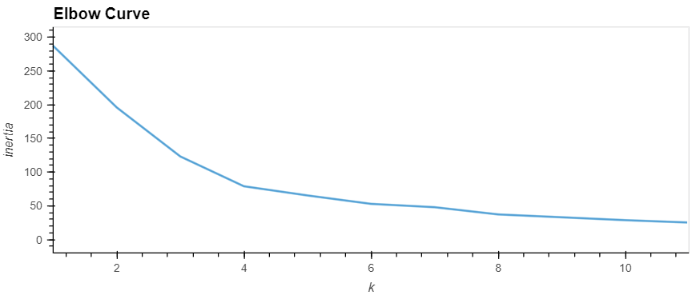
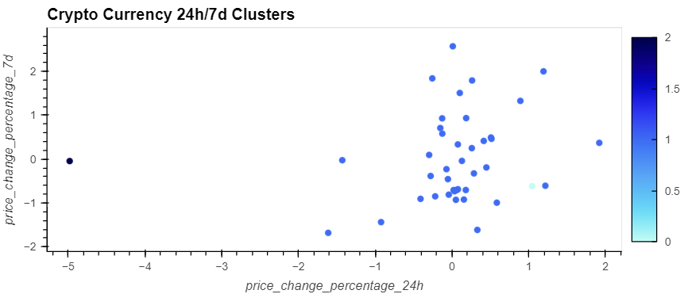
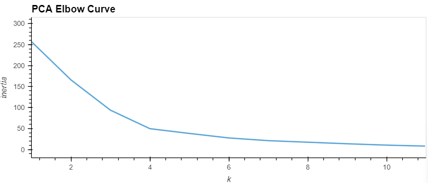
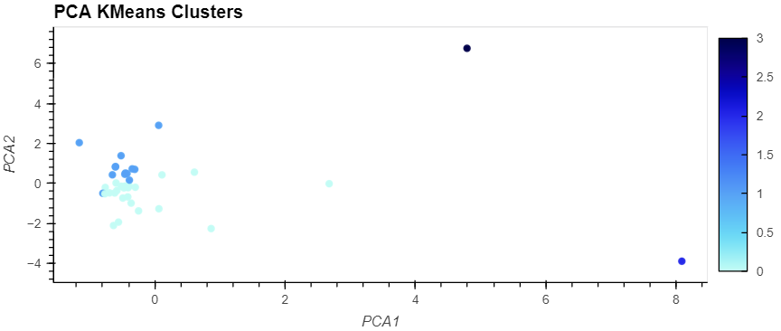

<h1>CryptoClustering</h1>

This challenge will focus on using K-means clustering to group cryptocurrencies based on their price change percentage over the past 24 hours and 7 days. The research will also explore the impact of using fewer features to cluster the data by using Principal Component Analysis (PCA).

<h3>Key Tasks:<h3>

<ul>
<li>Find the best value for k by using the original data. This can be done using the elbow method algorithm.</li>
  

<li>Cluster the cryptocurrencies with K-means by using the original data.</li>
  

<li>Optimize the clusters with Principal Component Analysis (PCA).</li>

<li>Find the best value for k by using the PCA data.</li>
  

<li>Cluster the cryptocurrencies with K-means by using the PCA data.</li>
  

<li>Visualize and compare the results.</li>
</ul>

